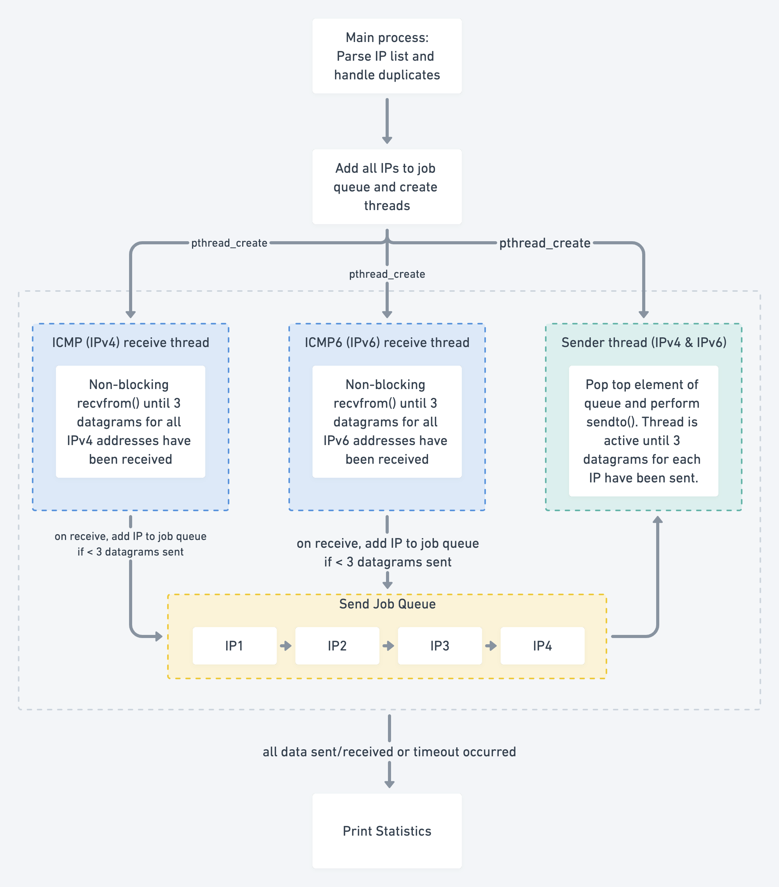

# NetProg Assignment 2 Q1 Design

# Run

```jsx
make rtt
sudo ./rtt.out IP_LIST_FILE_PATH [TIME_LIMIT] [SHOW_STATS (y/n)]
```

- `sudo` is required due to usage of raw sockets
- `IP_LIST_FILE_PATH`: Path to the file containing line separated list of IPv4 and IPv6 addresses
- `TIME_LIMIT`: [Default: `30`] Time in seconds after which the program should stop execution. See below under design on why a time limit is needed.
- `SHOW_STATS`: [Default: `n`] "y" if stats for time taken, throughput, loss count, etc. are to be shown.

# Features

- Handles both IPv4 and IPv6 addresses
- Uses ICMP (IPv4) and ICMPV6 (IPv6) to calculate RTT values
- Uses nonblocking I/O with multithreading for high throughput
- Handles duplicate IPs in the input file
- Implements hash table for fast search of received IP

# Design



The program parses the IPs from the file and identifies whether it is IPv4 or IPv6 based on a simplistic check for existence of the character `.` for IPv4 and `:` for IPv6. To handle duplicate IPs and for reasons mentioned below in "IPv4 receiving thread", the program adds all the IP addresses into a hash map. A good hashing function with a large hash table of size 7919 is used to minimise collisions. Then, it adds all the IPs into a *send job queue*. This queue contains all the IPs to which an ICMP/ICMPV6 message is to be sent. Note that the job queue always contains unique IP addresses.
Note: All socket IO in the program are non-blocking for high performance.

The program runs three threads in parallel.

- **Sender thread**: this thread is responsible for sending out the ICMP/ICMPV6 messages. It checks if the job queue is non-empty and sends a message containing the current time to the IP address.
- **IPv4 receiving thread**: this thread calls non-blocking `recvfrom` for IPv4 packets. Since we need to record 3 RTT values for each IP, we need a mechanism to save all three values in a common place. To implement this in O(1) time, a hash map is used to search for the IP and store their RTT values. Once the RTT has been stores, we check the number of ICMP messages sent to this IP. If this number is less than 3, we add this IP to the job queue.
- **IPv6 receiving thread**: same as IPv4 receiving thread but for ICMPV6 over IPv6

## Need for a timeout

As there was no way to implement a unique timeout after sending each message, it is possible that the receiving thread may never terminate. This will occur when the sending thread sends an ICMP message and the receiving thread is expecting a response but the server never responds.
Note that the sender thread is not guaranteed to terminate as well. Consider the scenario when sender sends the first ICMP message for an IP successfully and the receiver does not receive a response for that IP. In that case, the sender will be expecting the receiver to receive a response and add the IP back to the job queue for sending the second ICMP message but since the server did not respond, this never happens.

For the reasons mentioned above, a program wide timeout is used. Note that:

- When a timeout expires but there are still IPs in the job queue or messages being received by the receiver thread, the program waits for them and then terminates the threads.
- The default value of the timeout is 30s.
- The timeout value will affect the throughput statistics shown in the program.
- On error in an ICMP message, the RTT is recorded as -1.

# Example

The program was tested against a file containing 48 IPv6 and 331 IPv4 addresses. The statistics are shown below.

```jsx
==== BEGIN STATS ====

No. of unique IPs: 379, RTT success: 1095, RTT loss: 42
Time taken: 30.004s, Timeout expired: yes, Throughput: 12.63 (IP/sec)

==== END STATS ====
```

Interpretation:

- The file contained 379 IP addresses
- 1095 ICMP (IPv4 or IPv6) messages were successfully sent and received and the corresponding RTT was calculated
- 42 ICMP (IPv4 or IPv6) messages had some error (failed to send or response not received)
- The program took 30s. It was ended due to timeout expiration
- Achieved throughput of 12.63 IP/sec