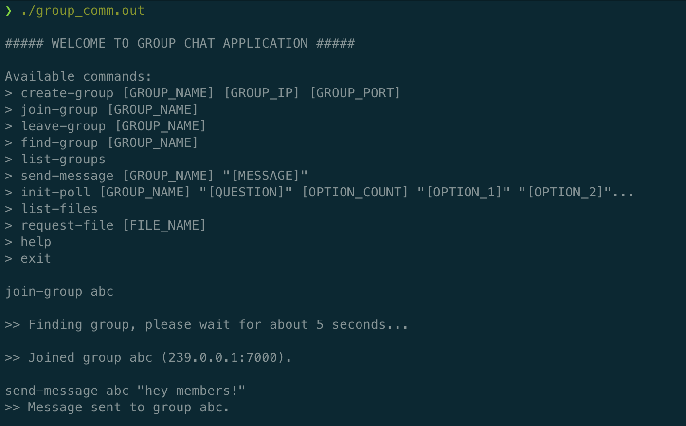
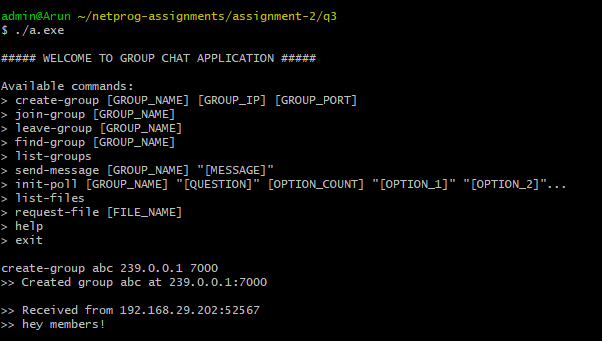
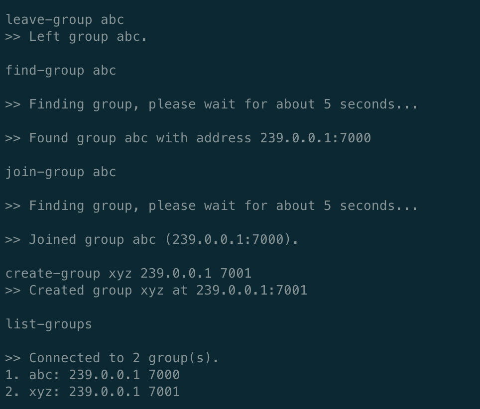
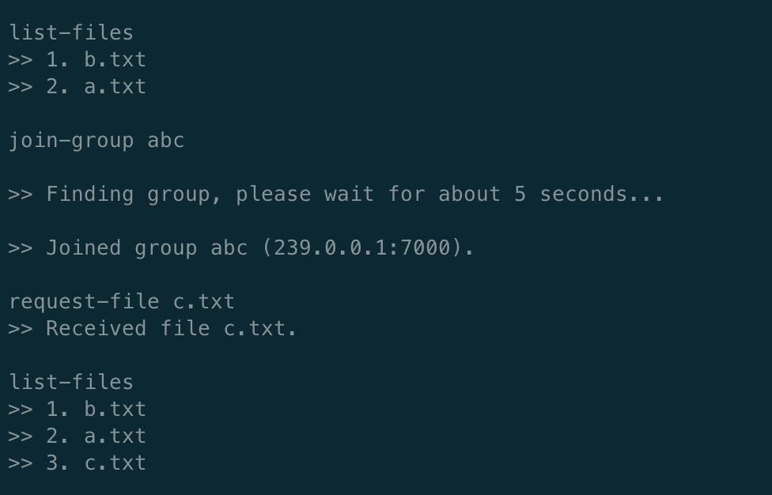

# NetProg Assignment 2 Q3 Design

## Run

```jsx
make run
./group_comm.out
```

**Note: The program is supposed to be run on different machines. Two instances on the same machine will not work as there will be a broadcast port conflict.**

## Assumptions

To support the extensive set of features while keeping the architecture simple, several assumptions were made.

- Group names and IP, Port pairs across all systems are assumed to be unique. That is, there cannot be two groups with the same name or with same IP and Port.
- Port `8000` is reserved as the broadcast port.
- Multicast self-loop is turned off. That is, the client itself does not receive its messages or polls.
- Only IPv4 is supported.
- The files to be shared among multicast groups are assumed to be present in the `./files` directory. The program creates an empty directory if it does not already exist.
- Names of files across all systems are assumed to be unique. That is, if client A and B both have a file called "shared.txt" then it is assumed to be the same file and it is not requested by either client when file list multicast takes place.
- Reasonable constraints on sizes of data were assumed, mostly to support a constant packet size over the network in order to avoid serialization and deserialization.
    - Group name length - 20 characters
    - Message length - 100 characters
    - File name length - 20 characters
    - Maximum files for a client - 30
    - Maximum number of options in poll - 5
    - Command length - 1024 characters
    - Maximum groups in a connected component - 20
    *If we consider a system as a node and create an edge between two systems if they are a part of a common group, then every 60 seconds, the file list information is shared across this complete connected component. A maximum of 20 groups are assumed in this connected graph.*

## Supported Commands and Design

### `create-group [GROUP_NAME] [GROUP_IP] [GROUP_PORT]`

Example: `create-group abc 239.0.0.1 7000`

The command initialises a new multicast group and joins it. This group is now discoverable by all other clients in the LAN.

### `find-group [GROUP_NAME]`

Example: `find-group abc`

The command sends a broadcast message on LAN to all the clients to search for the group. A new socket is initialised and bound to an ephemeral port receiving for potential unicast reply. This port is a part of the broadcast message. The client waits for 5 seconds to receive a response. If a group is found, the responding client sends a UDP unicast message on the client IP and mentioned port.

To avoid IPC, the client blocks for 5 seconds on the `recvfrom` command while finding the group. Thus, the client does not display any other messages received during that period.

Sample response -

```jsx
>> Found group abc with address 239.0.0.1:7000
```

### `join-group [GROUP_NAME]`

Example: `join-group abc`

The command first searches for the group exactly like `find-group [GROUP_NAME]`. If a group is found, it joins the multicast group. This is basically `find-group` followed by `create-group`.

Sample response -

```jsx
>> Joined group abc (239.0.0.1:7000).
```

### `leave-group [GROUP_NAME]`

Example: `leave-group abc`

Leaves the multicast group using `IP_DROP_MEMBERSHIP`.

### `list-groups`

List the multicast groups the client has joined.

Sample response -

```jsx
>> Connected to 2 group(s).
1. abc: 239.0.0.1 7000
2. xyz: 239.0.0.1 7001
```

### `send-message [GROUP_NAME] "[MESSAGE]"`

Example: `send-message abc "Lorem ipsum dolor"`

Send a message to the group. As multicast loop is turned off, the client itself does not receive the message on Linux distributions (the behaviour is observed to be different on MacOS and Windows).

**Note: The message must be inside quotes.**

### `init-poll [GROUP_NAME] "[QUESTION]" [OPTION_COUNT] "[OPTION_1]" "[OPTION_2]"...`

Example: `init-poll abc "When is Covid-19 going to peak?" 3 "May 1-15" "May 15-30" "June 1-15"`

The command sends a poll message on the multicast group. Like `find-group`, it initiates a socket and binds it to an ephemeral port in order to receive UDP unicast replies. The port number is sent along with the poll message. All group members are prompted with the question and asked to select an option. The sending client waits for 10 seconds to collect more responses after each response is received.

Unlike `find-group`, `init-poll` does not block on `recvfrom`. Instead, it forks a new process to receive responses. Hence, the client can receive other messages during a poll.

**Note: The question and options must be in quotes. The maximum option count is 5.**

Sample response -

```jsx
Receiving client:
	>> Please vote for the poll - 
	>> When is Covid-19 going to peak?
	>> 1. May 1-15
	>> 2. May 15-30
	>> 3. June 1-15
	
	Enter option number: 2

Sending client:
	>> 192.168.29.202:60022 selected option 2. Waiting 10s for other replies...
	>> 192.168.29.163:54189 selected option 1. Waiting 10s for other replies...
	
	>> Final option count: 
	>> Option 1 -> 1
	>> Option 2 -> 1
	>> Option 3 -> 0
```

### `list-files`

List the files the client currently has. This would always be in sync with the files present in `./files` directory.

### `request-file [FILE_NAME]`

Example: `request-file a.txt`

This command sends a message to all multicast groups of the client searching for the file. The receiving clients **do not** pass on this request to their own multicast groups. Like `find-group` and `init-poll` commands, the sending client initiates a socket and binds it to an ephemeral port. The port number is sent along with the file request message for potential unicast communication. Unlike both `find-group` and `init-poll` commands, the unicast communication in this case is over the TCP protocol.

If any of the receiving clients has the file, it tries to establish a TCP connection. Only the first client can successfully connect and all other connection requests are ignored. Once connected, the file is transferred in chunks over TCP. The received file is saved in the `./files` directory.

Sample response -

```jsx
request-file c.txt
>> Received file c.txt.
```

### `help`

Lists the available commands.

### `exit`

Cleanup and exit. `Ctrl + C` also works.

## Periodic file name sharing

Every 1 minute, each client shares the list of files to all multicast groups it has joined. If a receiving client is part of other multicast groups, this list is further propagated to them. If we assume clients to be nodes and an edge between two nodes if they are part of a common group, it can be seen that every 1 minute, the file list of all clients is shared across this complete connected component. If user can’t find a file name in the list with them, they request for the file among their own multicast groups just like `request-file` command.

The propagation of file list can introduce an infinite loop if we do not keep any track of groups that have already received the file. To avoid this, the file list multicast message keeps track of a list of groups that have already received this list. If a client receives the list and is part of a group other than the ones tracked, it adds the group in the message and forwards it to that group. Notice that this may lead to a group receiving the same list twice (when two clients simultaneously send to a group) but it avoids infinite loops.

## Screenshots



Client A



Client B



Client A



Client A